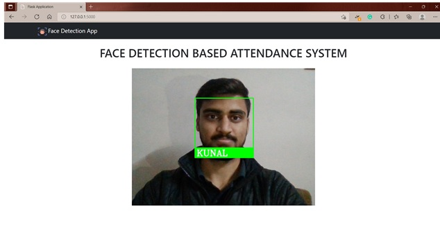

# Face-Detection-Based-Attendance-System
___
## 1.0 About Project : 

- This project was made in order to save time while taking attendance.
- It may look too-much for a small class, but in a large class, the project would do a great job.
- It is really simple to use, we just have to put student's image in the folder "IMAGE" along with image name set as student's name.
- Type "pyhton app.py" to start the flask locally.
- Open the link and port given in terminal, and in a few seconds (time depends on dataset), the camera will open and mark attendance accordingly.

## 2.0 Requirements for the Project:

- ### 2.1 Hardware Requirements:
    - (Not done so far) - Tried unsuccessfully in Raspberry-Pi
- ### 2.2 Software Requirements:
    - Visual Studio Code (or any Editor)
    - Face-Recognition library
    - Hosted locally in Flask

## 3.0 Snapshot of Project

**_Software UI looks like this_**

___
